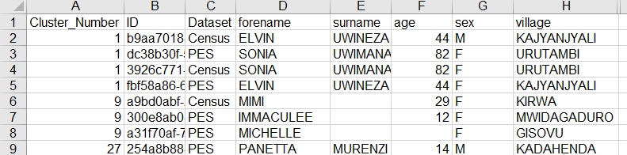
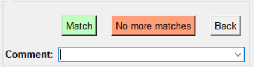
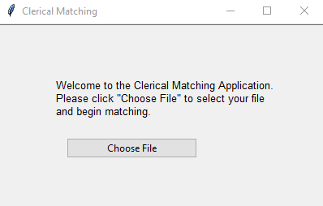
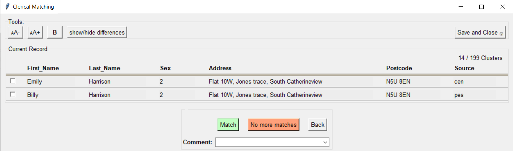
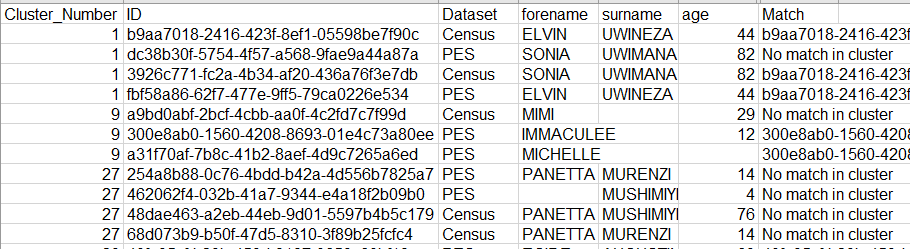
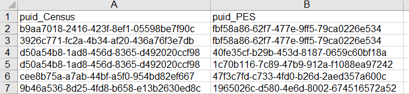

# CROW Cluster Version Instructions

> **Note:** All exemplar data displayed in this document is fake, synthetic data.

---
## Input File Requirements
The requirements for the files that you wish to clerically review are as follows;
- The files must be CSV files. 
- They must be ‘long’ files. There must be one row per record, containing 
 identifiable variables that are to be presented to clerical matchers for review.
 Clusters will contain multiple rows. See below for an example
- There must be a column that represents cluster ID. These ID’s can be any 
random string, so long as they are unique to each cluster. 
- There must be a record ID column. This must be unique for each record. 

Example ‘long’ file data format to be input to CROW:

---
## Setting Up the Config File (for project leads)

In order to adapt the cluster version of CROW to your data, you will need to adapt 
the config_clusters file to meet the needs of your project. Instructions for doing this 
are self-contained within the config file, however, below are the key points. 
### [column_headers_and_order]
This is where you can specify what text you want to appear as the header for each 
row. This can be independent of the column headers in your CSV. You only need to 
create titles for the variables you want to display.
### [column_file_info_and_order]
This is where you specify how CROW reads the variables in your CSV. Variable 
titles in this field MUST be the same as in your CSV. You only need to create titles 
for the variables you want to display.
### [cluster_id]
Specify which column is your cluster id column (MUST be the same as in your CSV). 
### [record_id]
Specify which column is your record id column (MUST be the same as in your CSV).
### [custom_settings]
There are a few optional custom settings that can be personalised for matching projects. These 
include:
### Commentbox: 
When set to 1, a comment box is displayed as shown below that allows clerical 
matchers to enter comments that will be appended to the relevant clusters in the matched file. If set 
to 0, this is not displayed.

---
## Custom Settings
comment_values: shows example dropdown options for the comment box that can be selected by 
clerical matchers. If left blank, no options are shown.

---
## Using the Cluster Review Version
To use the Cluster Version of CROW; users can simply click play in their given 
python editor. The below window will then pop-up. 

Clerical matchers can then choose the file they wish to match. 

## After selecting a file:
The below window will pop-up.

Users can then use the checkboxes on the left-hand side of the window to highlight 
records they wish to match, followed by clicking the ‘Match’ button. There can be 
multiple matches in a given cluster. Once all matches are exhausted, or the “No 
more matches” button is clicked, CROW will move on to the next cluster for 
resolution.

If users wish to add a custom comment, or a pre-determined comment about records 
in this cluster, a comment can be entered in the comment box (or selected from the 
drop-down tool) before a matching decision is made.
The back button can be used to return to the previous decision. Pressed the first 
time it will reset the current cluster (if some decisions have already been made in 
that cluster). Pressed again it will take the user back to the previous cluster. 

---
## The Output
A Match column is appended. The output file will look something like this:

A match column is appended to each row. If the given record has a match, the
record for that record and all the matches will be printed in the ‘Match’ column
separated by a comma. 
If there are no matches to a given record ‘No Matches In Cluster’ is printed in the
‘Match’ column. 
To get your outputs in a pairwise linked version (see below) run the
CROW_output_updater.py script.

